# Grabert Build Guide
- [Grabert Build Guide](#grabert-build-guide)
  - [Preparation and Layout Decisions](#preparation-and-layout-decisions)
    - [Determining Your Layout](#determining-your-layout)
    - [Required Components that are not supplied](#required-components-that-are-not-supplied)
    - [Required Tools](#required-tools)
  - [Build Instructions](#build-instructions)
    - [PCB Testing and Setup](#pcb-testing-and-setup)
    - [Switch Plate Assembly](#switch-plate-assembly)
    - [Case Assembly](#case-assembly)
  - [Errata](#errata)
## Preparation and Layout Decisions
### Determining Your Layout
The first step in building your keyboard is deciding what layout you want to use. If you have already picked out a keycap set, make
sure that the layout you choose can be achieved with the keycaps that you have.
With a standard 60% layout, Grabert uses 61 PCB Mount MX style switches with 1x 6.25U and 4x 2.00U PCB mount stabilizers. Grabert offers 4 layout options that can change these component requirements, as shown in the table below.
| Option | Key Size Change | Switch Requirement Change | Stabilizer Requirement Change |
|-|-|-|-|
| Split Backspace | 2.0U ⇨ 1.0U + 1.0U  | +1 | -1x 2.00U |
| Split Left Shift | 2.25U ⇨ 1.25U + 1.0U | +1 | -1x 2.00U |
| Split Right Shift | 2.75U ⇨ 1.75U + 1.0U | +1 | -1x 2.00U |
| Five Right Modifiers | 5x 1.25U ⇨ 4x 1.0U | +1 | No Change |
If this is your first time building a keyboard, it may be nice to use a default 60% layout, as you will still be able to use the right modifiers (bottom-right hand corner) as tapped arrow keys and any keycap set supports this layout. Use KLE's preset as an [example](http://www.keyboard-layout-editor.com/##@@=~%0A%60&=!%0A1&=%2F@%0A2&=%23%0A3&=$%0A4&=%25%0A5&=%5E%0A6&=%2F&%0A7&=*%0A8&=(%0A9&=)%0A0&=%2F_%0A-&=+%0A%2F=&_w:2%3B&=Backspace%3B&@_w:1.5%3B&=Tab&=Q&=W&=E&=R&=T&=Y&=U&=I&=O&=P&=%7B%0A%5B&=%7D%0A%5D&_w:1.5%3B&=%7C%0A%5C%3B&@_w:1.75%3B&=Caps%20Lock&=A&=S&=D&=F&=G&=H&=J&=K&=L&=%2F:%0A%2F%3B&=%22%0A'&_w:2.25%3B&=Enter%3B&@_w:2.25%3B&=Shift&=Z&=X&=C&=V&=B&=N&=M&=%3C%0A,&=%3E%0A.&=%3F%0A%2F%2F&_w:2.75%3B&=Shift%3B&@_w:1.25%3B&=Ctrl&_w:1.25%3B&=Win&_w:1.25%3B&=Alt&_a:7&w:6.25%3B&=&_a:4&w:1.25%3B&=Alt&_w:1.25%3B&=Win&_w:1.25%3B&=Menu&_w:1.25%3B&=Ctrl)
Grabert default layout:
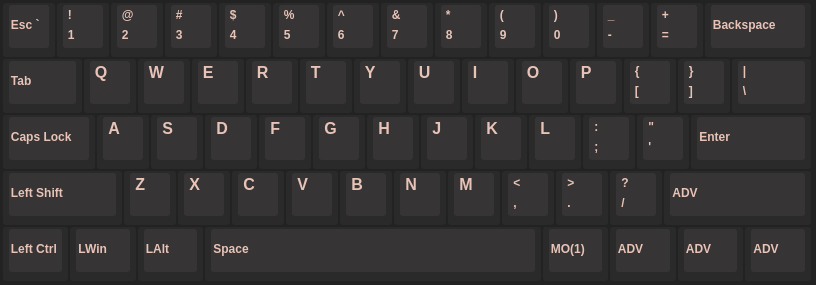
 
Grabert with all layout options utilized:

 
Once you have your layout chosen, grab your favorite switches and get them lubed!
 
We use [Super Lube 51004](https://www.amazon.com/gp/product/B000UKUHXK/) for our switches and [Super Lube 21030](https://www.amazon.com/gp/product/B06WLQ251B/) for our stabilizers, but use whatever you like. We loosely follow [Taeha Types's guide](https://youtu.be/qSgPKPoFo2k) as a process for our personal switches.
 
### Required Components that are not supplied
 
- Keycaps (Options: [Amazon](https://www.amazon.com/gp/product/B081DDG7CJ/), [MK](https://mechanicalkeyboards.com/shop/index.php?l=product_list&c=429&show=100&sortby=num_sold:desc))
- PCB Mount MX Style Switches (See [above](#determining-your-layout) for quantity) (Option: [Amazon](https://www.amazon.com/gp/product/B07TYD6Z3R/))
- PCB Mount Stabilizers (See [above](#determining-your-layout) for size/quantity) (Option: [Amazon](https://www.amazon.com/gp/product/B07ZLXCWY9/))
- Switch/Stabilizer Lubricant (**Optional**)
- USB-C Cable (Option: [Amazon](https://www.amazon.com/gp/product/B07VQYLXJC/))
 
### Required Tools
 
| Tool | Purpose |
|-|-|
| Soldering Iron and Solder | Soldering in MX style switches |
| Metric Hex Key Set| Assembling the case |
| Small Phillips Head ScrewDriver| Screwing in PCB Mount Stabilizers |
| Pliers | Tightening hex nuts |
| Rubber Band | Holding the OLED Screen in place |
| Wire or Paperclip | Testing PCB Connections |
 

 
## Build Instructions
 
The beginning of the build is the most difficult, so get your coffee or tea and get going! ☕🔨
 
### PCB Testing and Setup
1. Launch VIA and import the `grabert.json` keymap. If you do not know how to do this, see the [Using VIA guide](using_via.md).
2. Plug-in your Grabert PCB via the USB-C connector and make sure that VIA recognizes the keyboard. (Note: We test all PCBs are recognized before shipment, but this makes sure everything is working correctly when delivered.)
3. Go to the "LAYOUTS" section and define which layout options you want. See the [Determining Your Layout](#determining-your-layout) section for help on determining what you should use. 
4. Go to the "KEY TESTER" panel in VIA and toggle the "Test Matrix" 
5. Use a spare wire or a paperclip to test that each key is registered. You do not need to light up the lone square at the bottom right corner, as this represents the encoder.  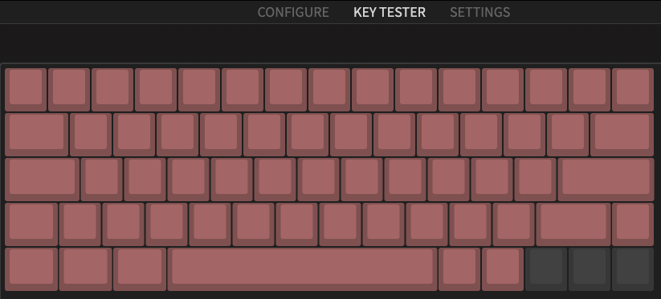
6. Unplug the USB-C cable from the PCB once all keys are "lit" except for the bottom-right hand key. If not all keys light up, contact us at kobussllc@gmail.com
7. Lubricate your stabilizers if you wish, and then install them onto the PCB. To install the stabilizers, snap them onto the PCB and screw them in from the back of the PCB. The side of the stabilizer with the screw goes into the smaller hole in the PCB. The screw will be on "the top" for all the small stabilizers and on "the bottom" for the large space bar stabilizer. Screw them in very slightly past hand tight. 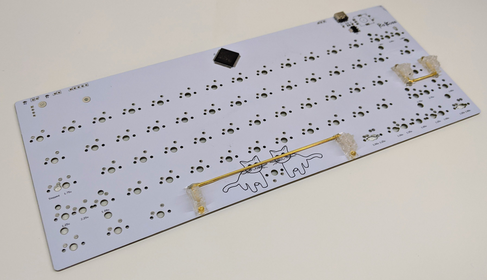
 
### Switch Plate Assembly
1. Gather the POM switchplate and your lubricated switches. Place **all** the switches that match your layout pattern that you have chosen into the switch plate. Making sure that the switch is “clipped” in place and is securely in the switch plate. Use your thumb and opposing finger to apply pressure at the clip in point and the switch plate. Make sure you hear a clicking sound (sometimes faint). This may be difficult on your hands, so take a break if you need to.  In spaces like the right modifier area, make sure you reference the CB to make sure the switches are in the correct location of the cutout. Note: The switch should be perpendicular to the switchplate.  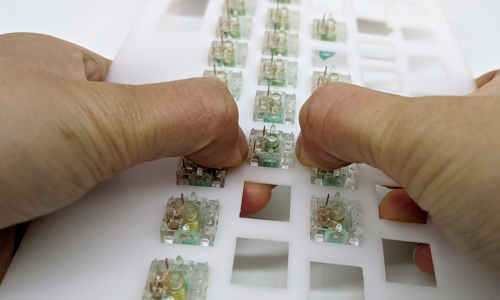
2. With all of the switches in the switch-plate, place the switch plate onto the PCB. This step may seem simple, but it is important to do it without applying pressure that may push the switches out of the switch-plate. You may also need to correct for any switch placement misalignment. 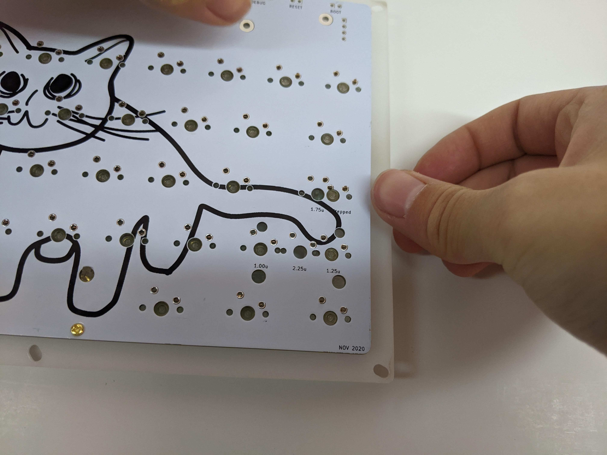
3. Press down on the PCB, with the top of the switches touching your work surface. This may take quite a bit of pressure and is best done from one corner to another. Make sure that all switches are pressed in all the way and perpendicular. Any misalignment here could cause your keycaps to touch each other. 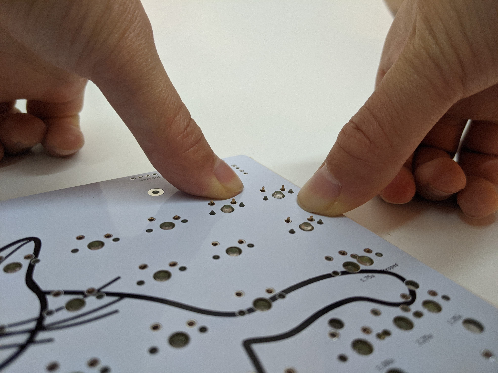 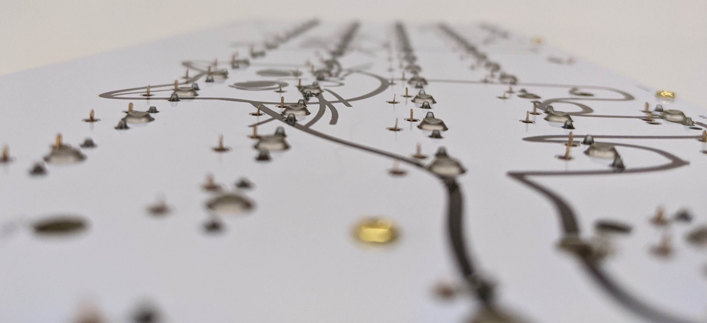
4. With all the switches inserted into the PCB, with the switch plate sandwiched between, solder all pins of the switches. Note that the bottom pin is the ground pin and may take more heat from your soldering iron. [Sparkfun's Soldering Guide](https://learn.sparkfun.com/tutorials/how-to-solder-through-hole-soldering/all) for reference. 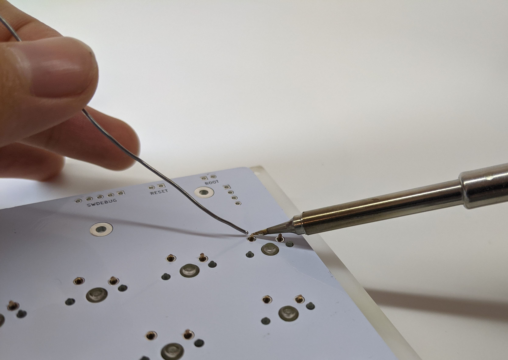
5. After soldering all the switches, take the encoder and forcefully place the pins into the PCB's top-right corner. If it is feeling extra difficult, you may need to push on the tabs with a screwdriver to make the encoder snap into place. 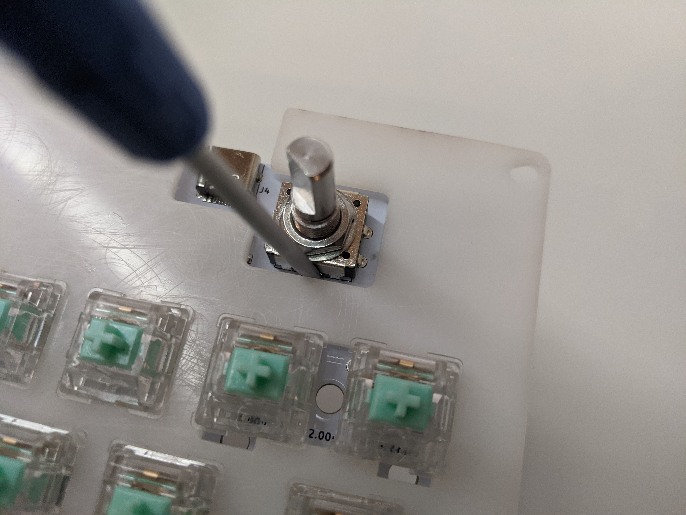
6. Solder all 7 pins of the rotary encoder and make sure to take off the washer and nut on the top of the rotary encoder. 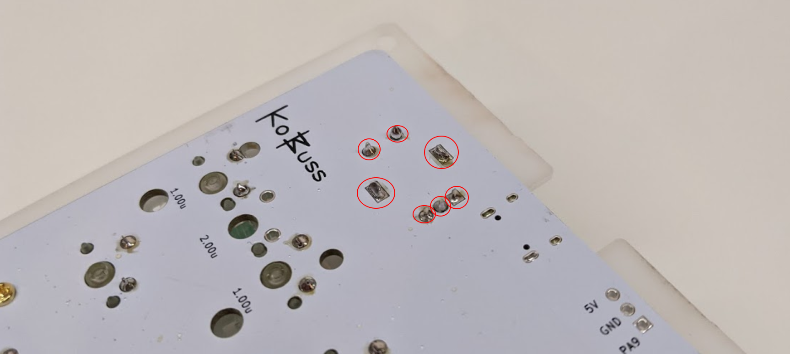
7. Take the two 6mm standoffs with 2mm nuts and fasten them in the holes on the PCB under the OLED. These standoffs will support the OLED installation for easy alignment. The nuts can be tightened with pliers just past hand tight. 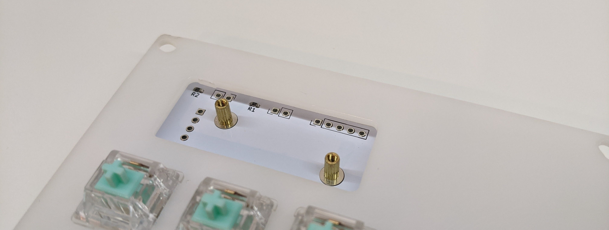 
8. Insert the OLED display (peel the protective sheet off) into the top and rest it upon the installed standoffs. Recommended: Stretch a rubber band around the assembly to hold the OLED in place while you solder it. 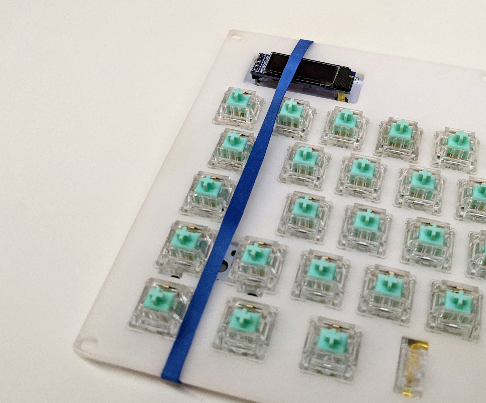
9. Solder the four pins of the OLED display and make sure the display is aligned. It is alway good to solder just one pin and check alignment before soldering the rest of the pins 
10. Plug the switch plate assembly into the your computer via the USB-C connector
11. Go back to the "KEY TESTER" in VIA and reset the keyboard. Press all the switches to test and see if your soldering was successful. If some of the switches don’t work, check your solder connections and pins. If the OLED does not work, check its connections as well.
12. Unplug your partially assembled keyboard, we are in the home stretch! 🏁🏃
 
### Case Assembly
 
1. Clean the OLED display and solder joints with a cloth coated in isopropyl alcohol
2. Grab the casing materials and start with the bottom plate along with two 6mm standoffs and four screws (Skip the standoffs and foot pieces if you do not want an inclined keyboard)
3. The bottom plate is symmetrical, so pick a side and call it "the top". Screw the two 6mm standoffs into the “center” holes with two screws. Hand tight is adequate. 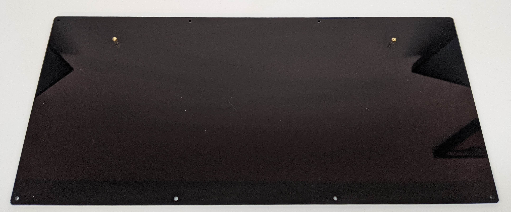
4. Place the acrylic foot pieces from largest to smallest onto the standoffs. Capture the smallest acrylic piece by screwing in the remaining 2mm screws hand tight. The holes in the acrylic feet should be towards the top of the keyboard. 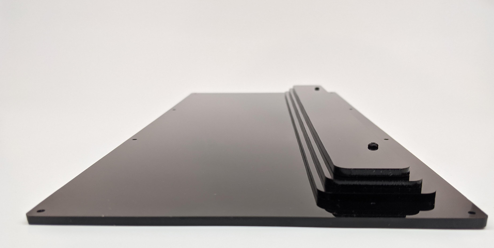
5. Gather the rest of the standoffs (8) and 8 screws. Align a standoff with one of the holes on the top side of the base (opposite side of where the foot is) and screw in a screw to the standoff on the other side. Repeat 7 more times. 
6. Grab one closed spacer and press the spacer onto the base, aligning the holes of the spacer to the standoffs 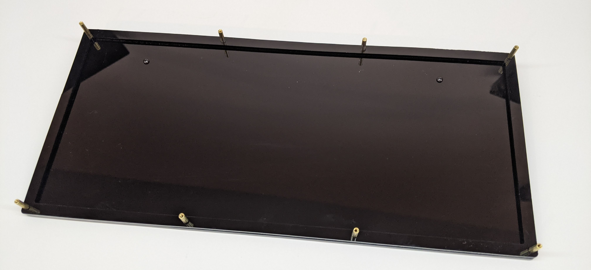
7. Place two open spacers on top, aligning the USB cut out to the right side. 
8. Place your completed switch plate assembly on top.  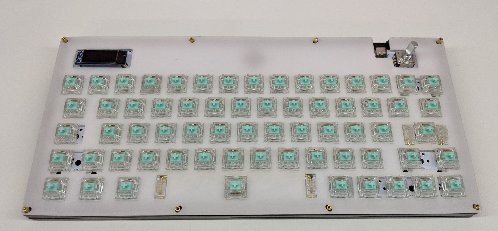
9. Place the last closed spacer onto the switchplate. 
10. Lastly, grab the opaque top with the opening for the OLED screen and align the holes with the standoffs. Wipe off the opaque top with alcohol before placing the clear cover on top. Then, take the remaining screws and screw in the top. Note: If you are having difficulty threading in the top screws, make sure all the holes are aligned and loosen the bottom screws a couple of turns. 
11. Take the rotary encoder washer and nut and fasten them on top of the encoder. Use pliers to make the nut hand tight. 
12. Unscrew the rotary encoder knob set screw and then place it on the top of the rotary encoder. Tighten the set screw while holding the knob slightly away from bottoming out. This makes it so that when you press the knob you are not hitting the acrylic, but actuating the rotary encoder switch. 
13. Place the rubber feet onto the bottom of the case wherever makes sense for you. Typically this is done on the bottom edge of the foot and the bottom left and right corners.
14. Place your keycaps on the switches 🙌
15. Use VIA to configure your keymapping! 🎉
16. Experts: [customize your firmware](firmware_customization.md)
 
## Errata
 
- The switch plate or PCB may warp in shipping or during assembly. This is acceptable in small amounts, but if there is two much pressure, it may add friction to the switches. To correct any major warping, support the edges of the switch plate or PCB with two books and put a small weight in the center. If you leave this overnight, the plate should plastically deform and hopefully become more flat.

