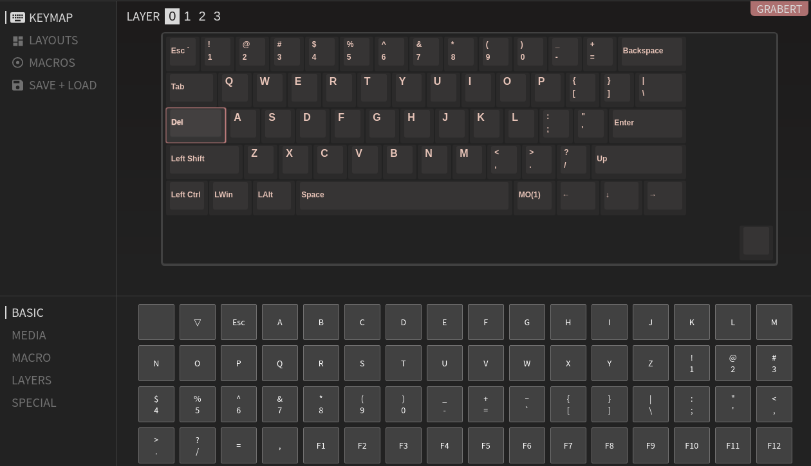

# Using VIA

QMK firmware with VIA enabled is the default firmware on all Grabert keyboards. VIA allows for dynamic changing of keymaps through a desktop application. VIA does not currently support all of the advanced [software features of QMK](https://docs.qmk.fm/#/feature_auto_shift), so if you are interested in using those, see the [firmware customization documentation](firmware_customization.md).

For all official VIA documentation see the VIA [website](https://caniusevia.com/) and QMK's  [repository]().

## Setting up VIA for Grabert

1. Download VIA from the [official website](https://caniusevia.com/) for your respective OS.

2. As of right now, Grabert is not in the upstream VIA keyboards repo, therefore you also need to download the [grabert.json](https://raw.githubusercontent.com/KoBussLLC/keyboards/kobuss/src/kobuss/grabert/grabert.json) from the KoBussLLC fork. (Click the hyperlink and right-click "Save Page As..." into your computer)
   
3. Launch VIA through your OS
4. Select "Import Keymap" from your OS's menu
5. Select the `grabert.json` file from your computer that you just downloaded
6. Use VIA in whatever way you want. The main operations are selecting a layer and then a key and choosing what you want the coresponding key to represent. 
7. Dive into setting up custom "Macros" and advanced layering once you are ready.

### Additional Information

- [Keyboard Layout Editor Permalink](http://www.keyboard-layout-editor.com/##@@_x:3%3B&=0,0&=0,1&=0,2&=0,3&=0,4&=0,5&=0,6&=0,7&=0,8&=0,9&=0,10&=0,11&=0,12&_w:2%3B&=0,13%0A%0A%0A0,0&_x:0.5%3B&=0,13%0A%0A%0A0,1&=0,14%0A%0A%0A0,1%3B&@_x:3&w:1.5%3B&=1,0&=1,1&=1,2&=1,3&=1,4&=1,5&=1,6&=1,7&=1,8&=1,9&=1,10&=1,11&=1,12&_w:1.5%3B&=1,13%3B&@_x:3&w:1.75%3B&=2,0&=2,1&=2,2&=2,3&=2,4&=2,5&=2,6&=2,7&=2,8&=2,9&=2,10&=2,11&_w:2.25%3B&=2,12%3B&@_w:1.25%3B&=3,0%0A%0A%0A1,1&=3,1%0A%0A%0A1,1&_x:0.75&w:2.25%3B&=3,0%0A%0A%0A1,0&=3,2&=3,3&=3,4&=3,5&=3,6&=3,7&=3,8&=3,9&=3,10&=3,11&_w:2.75%3B&=3,12%0A%0A%0A2,0&_x:0.5&w:1.75%3B&=3,12%0A%0A%0A2,1&=3,13%0A%0A%0A2,1%3B&@_x:3&c=%23AAAAAA&w:1.25%3B&=4,0&_w:1.25%3B&=4,1&_w:1.25%3B&=4,2&_c=%23cccccc&w:6.25%3B&=4,3&_c=%23AAAAAA&w:1.25%3B&=4,4%0A%0A%0A3,0&_w:1.25%3B&=4,5%0A%0A%0A3,0&_w:1.25%3B&=4,7%0A%0A%0A3,0&_w:1.25%3B&=4,8%0A%0A%0A3,0%3B&@_y:0.25&x:13%3B&=4,4%0A%0A%0A3,1&=4,5%0A%0A%0A3,1&=4,6%0A%0A%0A3,1&=4,7%0A%0A%0A3,1&=4,8%0A%0A%0A3,1&_x:1.5&c=%23cccccc%3B&=4,9) used to generate the VIA grabert.json file
- [VIA Layout documentation](https://caniusevia.com/docs/layouts)